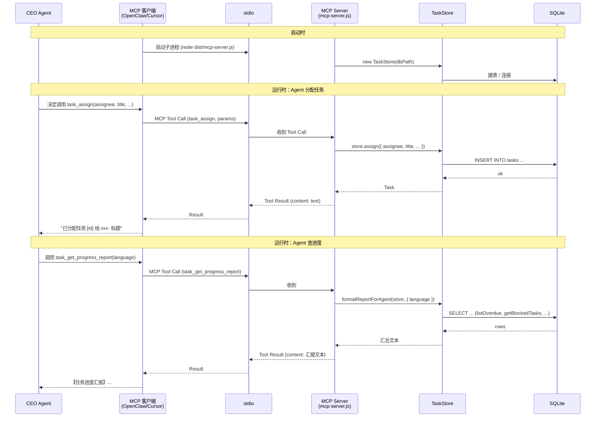
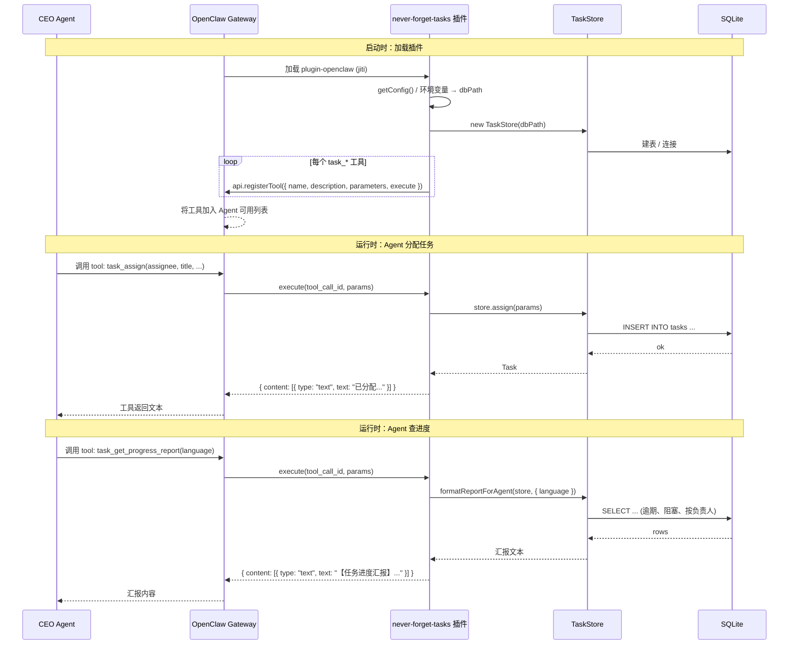
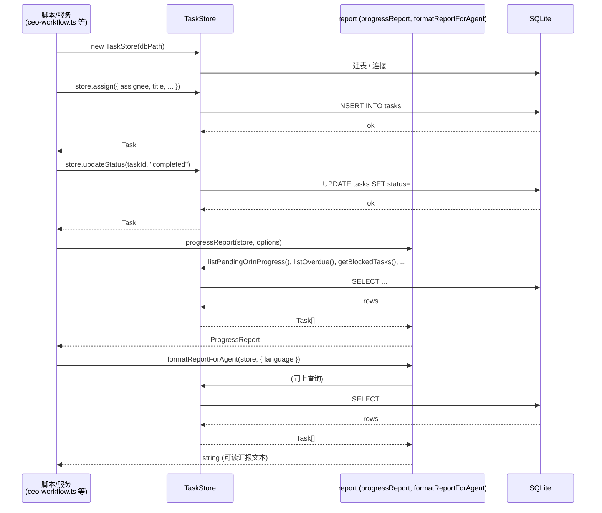
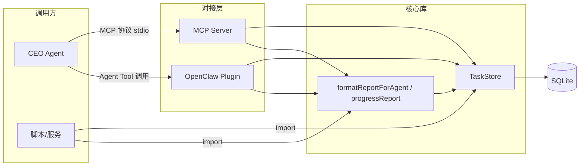

# 主要流程序列图

本文档用序列图说明「不能忘任务」在 **MCP**、**OpenClaw 插件**、**库直接调用** 三种形态下的工作方式。

---

## 1. MCP 路径：Agent 通过 MCP 调用任务工具

OpenClaw / Cursor / Claude 等作为 MCP 客户端，通过 stdio 与 MCP Server 通信；Agent 看到的是一组 MCP Tools（如 `task_assign`、`task_get_progress_report`）。

---

## 2. OpenClaw 插件路径：进程内 Agent Tools

插件在 OpenClaw Gateway 进程内加载，注册一组 Agent Tools；Agent 调用时由 Gateway 直接调用插件的 `execute`，无需单独 MCP 进程。

---

## 3. 库直接调用：脚本/服务内使用 TaskStore

在自有 Node/TS 脚本或服务中直接 `import` 核心库，不经过 MCP 或插件。

---

## 4. 三种形态与核心库的关系（概览）

- **MCP**：独立进程，通过 stdio 与客户端通信，内部使用 TaskStore + report。
- **Plugin**：进程内注册 Agent Tools，内部同样使用 TaskStore + report，可与 MCP 共用同一 `dbPath`。
- **库**：直接使用 TaskStore 与 report，同一套数据与逻辑。
