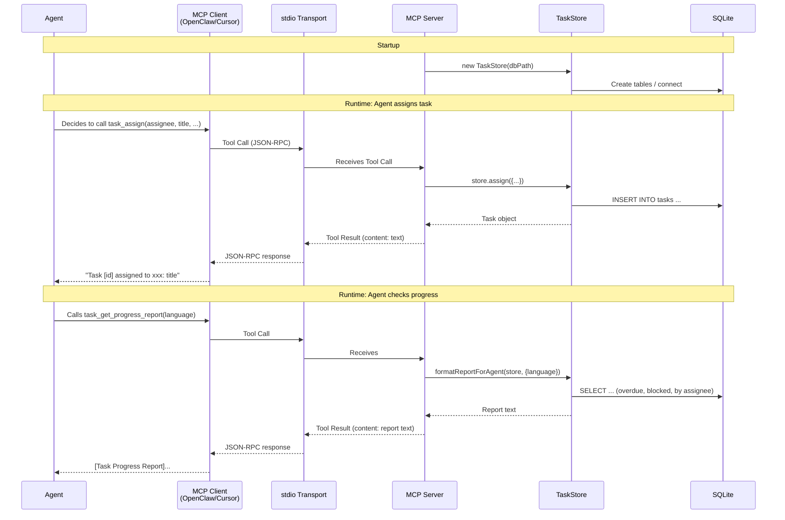
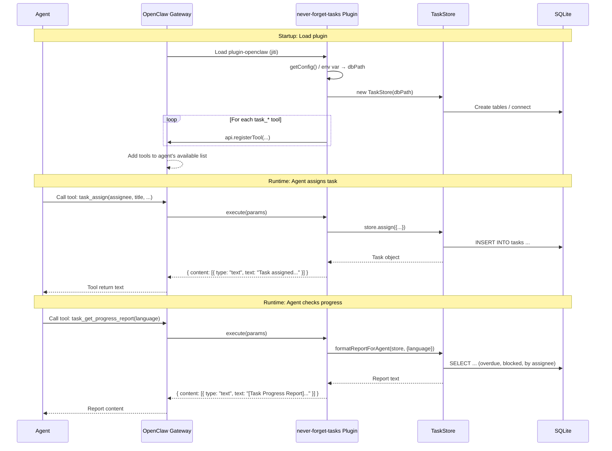
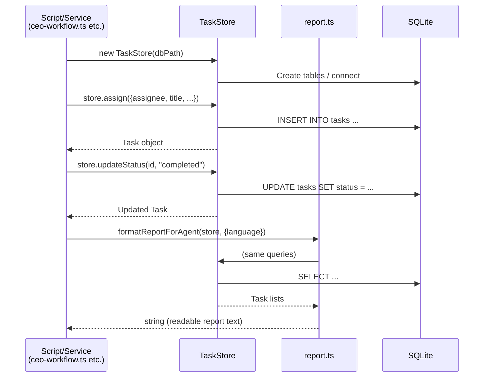
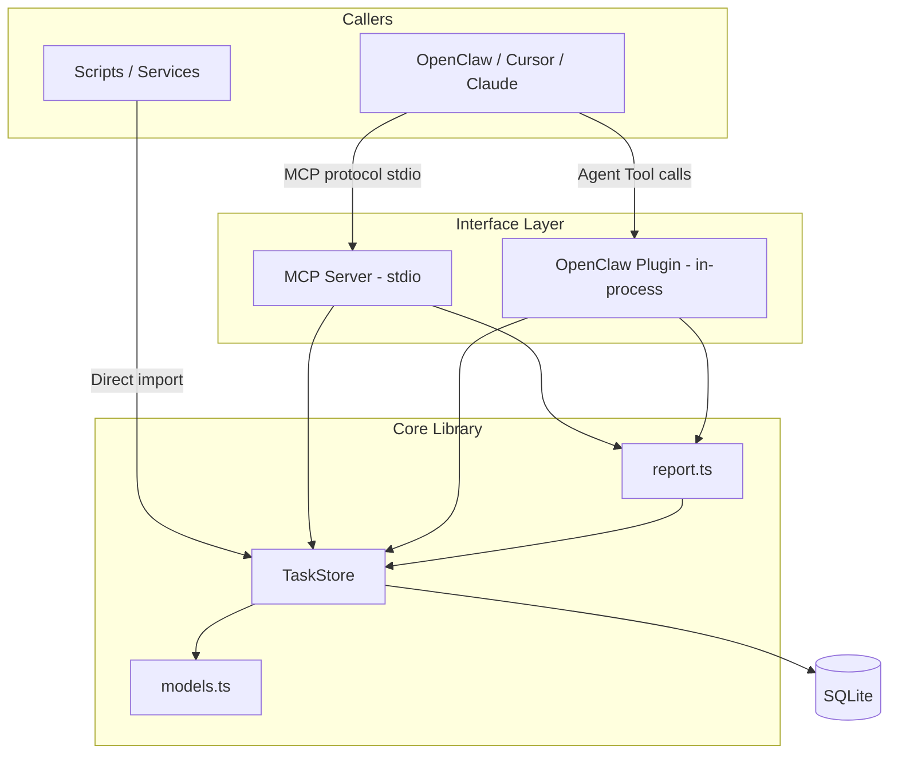

# Sequence Diagrams

This document illustrates how "Never Forget Tasks" works in **MCP**, **OpenClaw Plugin**, and **direct library call** paths.

---

## 1. MCP Path: Agent calls task tools via MCP

OpenClaw / Cursor / Claude acts as an MCP client, communicating with the MCP Server via stdio. The agent sees MCP Tools like `task_assign` and `task_get_progress_report`.

---

## 2. OpenClaw Plugin Path: In-Process Agent Tools

The plugin loads within the OpenClaw Gateway process, registering Agent Tools. When the agent calls a tool, Gateway directly invokes the plugin's `execute` — no separate MCP process needed.

---

## 3. Direct Library Call: Using TaskStore in Scripts/Services

Import the core library directly in your own Node/TS scripts or services, without going through MCP or plugin.

---

## 4. Relationship Between Three Forms and Core Library (Overview)

**Key points**:

- **Library**: Core — models, store, report. Single source of truth.
- **MCP**: Standalone process, communicates via stdio with clients, uses TaskStore + report internally.
- **Plugin**: In-process Agent Tools registration, also uses TaskStore + report internally, can share the same `dbPath` with MCP.
- **Library**: Direct use of TaskStore and report, same data and logic.
